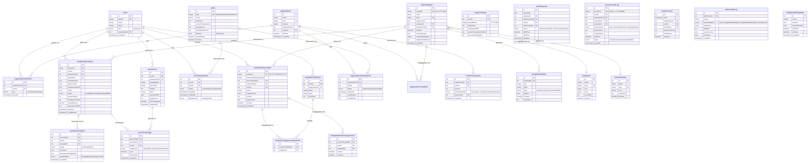

# KI2GO - Vollständige Systemdokumentation

**Version:** 5.0  
**Stand:** 29. Januar 2026  
**Autor:** Manus AI für ProAgentur GmbH

---

## Inhaltsverzeichnis

1. [Systemübersicht](#1-systemübersicht)
2. [Datenmodell](#2-datenmodell)
3. [Implementierte Prozesse](#3-implementierte-prozesse)
4. [Benutzerrollen und Berechtigungen](#4-benutzerrollen-und-berechtigungen)
5. [Feature-System und Preispläne](#5-feature-system-und-preispläne)
6. [API-Übersicht](#6-api-übersicht)
7. [Offene Punkte](#7-offene-punkte)

---

## 1. Systemübersicht

KI2GO ist eine B2B-SaaS-Plattform, die Unternehmen ermöglicht, KI-gestützte Aufgaben auszuführen, ohne selbst KI-Expertise zu benötigen. Das System basiert auf einem **Superprompt-Template-System**, bei dem vordefinierte Aufgaben-Templates von Kunden verwendet werden können.

### Kernkonzept

```
┌─────────────────────────────────────────────────────────────────────┐
│                        KI2GO ARCHITEKTUR                            │
├─────────────────────────────────────────────────────────────────────┤
│                                                                     │
│   ADMIN/OWNER                    KUNDE                              │
│   ┌─────────────┐               ┌─────────────┐                     │
│   │ Superprompt │──────────────▶│ Custom      │                     │
│   │ Templates   │   1:1 Kopie   │ Templates   │                     │
│   │ (SP-2026-X) │               │ (SP-X-KYYY) │                     │
│   └─────────────┘               └──────┬──────┘                     │
│         │                              │                            │
│         │                              ▼                            │
│         │                       ┌─────────────┐                     │
│         │                       │ Aufgaben-   │                     │
│         └──────────────────────▶│ Ausführung  │                     │
│                                 └──────┬──────┘                     │
│                                        │                            │
│                                        ▼                            │
│                                 ┌─────────────┐                     │
│                                 │ Ergebnis +  │                     │
│                                 │ ROI-Banner  │                     │
│                                 └─────────────┘                     │
│                                                                     │
└─────────────────────────────────────────────────────────────────────┘
```

### Technologie-Stack

| Komponente | Technologie |
|------------|-------------|
| Frontend | React 19 + TypeScript + Tailwind CSS 4 |
| Backend | Express 4 + tRPC 11 |
| Datenbank | MySQL (TiDB) |
| Authentifizierung | Manus OAuth |
| LLM | Gemini 2.5 Flash (via Manus Forge API) |
| Storage | S3-kompatibel |
| Hosting | Manus Cloud |

---

## 2. Datenmodell

Das Datenmodell besteht aus **28 Tabellen**, die in folgende Bereiche unterteilt sind:

### 2.1 Entity-Relationship Diagramm



### 2.2 Tabellen-Übersicht nach Bereich

#### Benutzer & Organisationen

| Tabelle | Beschreibung | Wichtige Felder |
|---------|--------------|-----------------|
| `users` | Alle registrierten Benutzer | openId, email, name, role, organizationId |
| `organizations` | Firmen/Mandanten | name, slug, industry, ownerId |
| `organizationMembers` | User-Zuordnung zu Firmen | organizationId, userId, role (owner/admin/member) |
| `organizationInvitations` | Einladungs-Codes | inviteCode, email, role, expiresAt |

#### Templates & Superprompts

| Tabelle | Beschreibung | Wichtige Felder |
|---------|--------------|-----------------|
| `taskTemplates` | Superprompt-Templates (Admin) | uniqueId (SP-YYYY-NNN), name, superprompt, categoryId |
| `templateVariables` | Variablen-Schema pro Template | templateId, key, type, label, required |
| `categories` | Aufgaben-Kategorien | name, slug, icon, color |
| `businessAreas` | Unternehmensbereiche | name, slug, icon |
| `metapromptTemplates` | Metaprompts für Generator | name, content, systemPrompt, isDefault |

#### Custom Templates (Kunden-spezifisch)

| Tabelle | Beschreibung | Wichtige Felder |
|---------|--------------|-----------------|
| `customSuperprompts` | 1:1 Kopien für Kunden | uniqueId (SP-X-KYYY-V1), baseTemplateId, userId |
| `templateCategories` | Kunden-eigene Kategorien | userId, name, color |
| `templateCategoryAssignments` | Template-Kategorie Zuordnung | customTemplateId, categoryId |
| `templateMemberAssignments` | Mitarbeiter-Freigaben | customTemplateId, userId, canUse |

#### Workflow & Ausführung

| Tabelle | Beschreibung | Wichtige Felder |
|---------|--------------|-----------------|
| `workflowExecutions` | Aufgaben-Ausführungen | sessionId, templateId, result, status, estimatedCost |
| `workflowFeedback` | Bewertungen | executionId, rating, comment, improvementSuggestion |
| `documents` | Hochgeladene Dokumente | originalName, fileUrl, extractedText, pageCount |
| `documentUsage` | Dokument-Nutzung | documentId, executionId, usageType, cost |

#### Preispläne & Subscriptions

| Tabelle | Beschreibung | Wichtige Felder |
|---------|--------------|-----------------|
| `plans` | Preispläne (Free/Starter/Business/Enterprise) | slug, taskLimit, teamMemberLimit, features |
| `userSubscriptions` | User-Abonnements | userId, planId, status, validUntil |
| `organizationSubscriptions` | Firmen-Abonnements | organizationId, planId, creditsUsed |
| `usageTracking` | Verbrauchs-Tracking | userId, periodMonth, tasksUsed, storageUsedMb |
| `creditTransactions` | Credit-Buchungen | organizationId, amount, transactionType |

#### Audit & Kosten

| Tabelle | Beschreibung | Wichtige Felder |
|---------|--------------|-----------------|
| `processAuditLog` | Vollständiges Prozess-Protokoll | processId (KI2GO-YYYY-NNNNN), totalCost, status |
| `costSummary` | Aggregierte Kosten | date, organizationId, totalCost, executionCount |
| `adminAuditLog` | Admin-Aktionen | adminUserId, action, targetType, previousValue |

#### Anfragen

| Tabelle | Beschreibung | Wichtige Felder |
|---------|--------------|-----------------|
| `taskRequests` | Individuelle Anfragen | description, status, offerPrice, deadline |

---

## 3. Implementierte Prozesse

### 3.1 Aufgaben-Ausführung (Hauptprozess)

```
┌──────────────────────────────────────────────────────────────────────┐
│                    AUFGABEN-AUSFÜHRUNG WORKFLOW                      │
├──────────────────────────────────────────────────────────────────────┤
│                                                                      │
│  1. TEMPLATE AUSWÄHLEN                                               │
│     └─▶ User wählt Template aus Katalog (/aufgaben)                  │
│         └─▶ System prüft: Hat User Custom-Template?                  │
│             └─▶ JA: Verwende Custom-Template                         │
│             └─▶ NEIN: Erstelle automatisch Custom-Template           │
│                       (ID: SP-2026-001-K42-V1)                       │
│                                                                      │
│  2. DOKUMENT UPLOAD (Optional)                                       │
│     └─▶ User lädt Dokument hoch (PDF, DOCX, etc.)                    │
│         └─▶ System extrahiert Text (pdf-parse)                       │
│         └─▶ System prüft OCR-Qualität                                │
│         └─▶ Warnung bei gescannten PDFs                              │
│                                                                      │
│  3. VARIABLEN EINGEBEN                                               │
│     └─▶ Dynamisches Formular aus variableSchema                      │
│         └─▶ Vorausfüllung aus Dokument-Analyse (wenn vorhanden)      │
│         └─▶ Hilfe-Texte und Beispiele pro Feld                       │
│                                                                      │
│  4. LLM AUSFÜHRUNG                                                   │
│     └─▶ Superprompt + Variablen + Dokument-Text                      │
│         └─▶ Gemini 2.5 Flash API                                     │
│         └─▶ Token-Tracking (Input/Output)                            │
│         └─▶ Kosten-Berechnung                                        │
│                                                                      │
│  5. ERGEBNIS ANZEIGEN                                                │
│     └─▶ Markdown-Rendering mit Streamdown                            │
│         └─▶ ROI-Banner (Zeitersparnis + Geldersparnis)               │
│         └─▶ Marketing-Banner (wenn aktiviert)                        │
│         └─▶ Export: TXT, HTML, PDF                                   │
│         └─▶ Bewertung (Daumen hoch/runter)                           │
│                                                                      │
└──────────────────────────────────────────────────────────────────────┘
```

### 3.2 Custom Template Erstellung (Automatisch)

Wenn ein Kunde ein öffentliches Template zum ersten Mal verwendet, wird automatisch eine 1:1 Kopie erstellt:

| Schritt | Aktion | Ergebnis |
|---------|--------|----------|
| 1 | User klickt auf Template | System prüft customSuperprompts |
| 2 | Kein Custom-Template gefunden | System erstellt Kopie |
| 3 | ID-Generierung | `SP-2026-001` → `SP-2026-001-K42-V1` |
| 4 | Speicherung | Neuer Eintrag in customSuperprompts |
| 5 | Nutzung | User arbeitet mit seinem Custom-Template |

**Wichtig:** Der Kunde kann sein Custom-Template **nicht bearbeiten**, nur:
- Kategorisieren (eigene Ordner)
- Mitarbeitern freigeben (Business Plan)
- Neue Templates bei ProAgentur bestellen

### 3.3 Firmen-Onboarding

```
┌──────────────────────────────────────────────────────────────────────┐
│                    FIRMEN-ONBOARDING PROZESS                         │
├──────────────────────────────────────────────────────────────────────┤
│                                                                      │
│  1. REGISTRIERUNG (/onboarding)                                      │
│     └─▶ Firmenname, Branche, Mitarbeiteranzahl                       │
│         └─▶ System erstellt Organization                             │
│         └─▶ User wird Owner der Organization                         │
│         └─▶ Test-Subscription (90 Tage) aktiviert                    │
│                                                                      │
│  2. MITARBEITER EINLADEN (/firma/users)                              │
│     └─▶ Einladungs-Link generieren                                   │
│     └─▶ E-Mail mit Code senden                                       │
│     └─▶ Mitarbeiter klickt Link (/einladung/:code)                   │
│     └─▶ Nach Login: Automatische Zuordnung zur Firma                 │
│                                                                      │
│  3. TEMPLATES FREIGEBEN                                              │
│     └─▶ Admin weist Templates der Organisation zu                    │
│     └─▶ Mitarbeiter sehen nur freigegebene Templates                 │
│                                                                      │
│  4. TESTPHASE-ABLAUF                                                 │
│     └─▶ 14 Tage vorher: Gelber Banner                                │
│     └─▶ 7 Tage vorher: Oranger Banner                                │
│     └─▶ Abgelaufen: Roter Banner + Upgrade-Option                    │
│                                                                      │
└──────────────────────────────────────────────────────────────────────┘
```

### 3.4 Superprompt-Generator (Admin)

Der Generator ermöglicht es Admins, neue Superprompt-Templates zu erstellen:

| Schritt | Beschreibung |
|---------|--------------|
| 1 | Metaprompt auswählen (oder Standard verwenden) |
| 2 | Aufgabenbeschreibung eingeben |
| 3 | KI generiert Superprompt + Variablen-Schema |
| 4 | Admin überprüft und bearbeitet |
| 5 | Als neues Template speichern (SP-YYYY-NNN) |

### 3.5 Marketing-Tab (Neu)

Jedes Template kann Marketing-Texte haben, die auf der Aufgaben-Seite angezeigt werden:

| Feld | Beschreibung | SEO-Relevanz |
|------|--------------|--------------|
| marketingHeadline | Haupt-Überschrift (max. 60 Zeichen) | Title-Tag |
| marketingSubheadline | Nutzenversprechen | Meta-Description |
| marketingUsps | 3-5 USP-Punkte | Structured Data |
| marketingCtaText | Call-to-Action | - |
| marketingEnabled | Banner anzeigen ja/nein | - |
| marketingMetaDescription | SEO-Beschreibung | Meta-Description |
| marketingKeywords | SEO-Keywords | Meta-Keywords |

---

## 4. Benutzerrollen und Berechtigungen

### 4.1 System-Rollen

| Rolle | Beschreibung | Zugriff |
|-------|--------------|---------|
| **Owner** | System-Administrator (ProAgentur) | Alles |
| **Admin** | Firmen-Administrator | Eigene Firma + Mitarbeiter |
| **User** | Normaler Benutzer | Nur freigegebene Templates |

### 4.2 Berechtigungsmatrix

| Aktion | Owner | Admin | User |
|--------|-------|-------|------|
| Templates erstellen | ✅ | ❌ | ❌ |
| Templates bearbeiten | ✅ | ❌ | ❌ |
| Custom Templates sehen | ✅ (alle) | ✅ (eigene Firma) | ✅ (eigene) |
| Custom Templates kategorisieren | ✅ | ✅ | ✅ |
| Mitarbeiter einladen | ✅ | ✅ | ❌ |
| Aufgaben ausführen | ✅ | ✅ | ✅ |
| Kosten-Analytics | ✅ | ❌ | ❌ |
| Prozess-Protokoll | ✅ | ❌ | ❌ |

---

## 5. Feature-System und Preispläne

### 5.1 Verfügbare Features

| Feature-Key | Beschreibung | Messbar |
|-------------|--------------|---------|
| `tasks` | Aufgaben ausführen | Limit/Monat |
| `custom_templates` | Custom Templates nutzen | Limit Anzahl |
| `template_sharing` | Templates an Mitarbeiter freigeben | ja/nein |
| `document_upload` | Dokumente hochladen | ja/nein |
| `document_download` | Ergebnisse herunterladen | ja/nein |
| `storage` | Datenraum für Unterlagen | Limit MB |
| `team_members` | Mitarbeiter einladen | Limit Anzahl |
| `monitoring` | Nutzungsverhalten einsehen | ja/nein |
| `masking` | Daten-Anonymisierung | ja/nein |
| `request_tasks` | Neue Aufgaben anfragen | ja/nein |

### 5.2 Geplante Preispläne

| Plan | Users | Tasks/Monat | Templates | Storage | Features |
|------|-------|-------------|-----------|---------|----------|
| **Free/Test** | 1 | 10 | 2 | 100MB | Basis |
| **Starter** | 1 | 50 | 10 | 1GB | + Download |
| **Business** | 10 | 500 | 50 | 10GB | + Sharing, Monitoring |
| **Enterprise** | 50 | ∞ | ∞ | 100GB | + Masking, Priority |

### 5.3 Feature-Check Helpers

```typescript
// Prüft ob Feature im Plan enthalten
checkFeature(userId, 'masking') → boolean

// Prüft ob Limit erreicht
checkLimit(userId, 'tasks') → { allowed: boolean, used: number, limit: number }

// Erhöht Verbrauch
incrementUsage(userId, 'tasks') → void
```

---

## 6. API-Übersicht

### 6.1 Haupt-Router

| Router | Beschreibung | Wichtige Endpoints |
|--------|--------------|-------------------|
| `auth` | Authentifizierung | me, logout |
| `workflow` | Aufgaben-Ausführung | execute, getExecution, getMyExecutions |
| `template` | Template-Verwaltung | list, create, update, delete, generateMarketing |
| `customSuperprompt` | Custom Templates | getAll, update, delete |
| `myTemplates` | Kunden-Dashboard | getAll, getCategories, assignToCategory |
| `organization` | Firmen-Verwaltung | create, addMember, assignTemplate |
| `subscription` | Abonnements | getPlans, getStatus, checkAccess |
| `audit` | Audit & Kosten | getProcessLog, getCostAnalytics |
| `export` | Export-Funktionen | exportTxt, exportHtml, exportPdf |

### 6.2 Wichtige API-Flows

**Aufgabe ausführen:**
```
workflow.getAvailableTasks → workflow.getTemplateForExecution → 
document.upload → workflow.execute → workflow.getExecution
```

**Custom Template erstellen (automatisch):**
```
workflow.execute → (intern) createCustomTemplate → customSuperprompts INSERT
```

**Kosten tracken:**
```
workflow.execute → (intern) calculateCost → workflowExecutions UPDATE
```

---

## 7. Offene Punkte

### 7.1 Noch zu implementieren

| Feature | Priorität | Status |
|---------|-----------|--------|
| Standard-Preispläne in DB anlegen | Hoch | Offen |
| Feature-Gates in workflow.execute aktivieren | Hoch | Offen |
| Stripe-Integration für Zahlungen | Mittel | Offen |
| Template-Statistiken Dashboard | Mittel | Offen |
| Open Graph Tags für Social Media | Niedrig | Offen |
| Drag & Drop Sortierung | Niedrig | Offen |
| E-Mail-Benachrichtigungen | Niedrig | Offen |
| Masking (Daten-Anonymisierung) | Später | Offen |

### 7.2 Bekannte Einschränkungen

1. **Kein Offline-Modus** - Anwendung benötigt Internetverbindung
2. **Keine On-Premise Option** - Aktuell nur SaaS
3. **Einzelner LLM-Provider** - Nur Gemini 2.5 Flash
4. **Keine Batch-Verarbeitung** - Dokumente einzeln verarbeiten

---

## Anhang: Datei-Struktur

```
ki2go-webapp-v5/
├── client/
│   ├── src/
│   │   ├── pages/           # Seiten-Komponenten
│   │   │   ├── Home.tsx
│   │   │   ├── Tasks.tsx
│   │   │   ├── TaskExecution.tsx
│   │   │   ├── TaskResult.tsx
│   │   │   ├── MeineTemplates.tsx
│   │   │   ├── Admin*.tsx   # Admin-Seiten
│   │   │   └── ...
│   │   ├── components/      # Wiederverwendbare Komponenten
│   │   │   ├── DashboardLayout.tsx
│   │   │   ├── PageHeader.tsx
│   │   │   └── ...
│   │   └── lib/
│   │       └── trpc.ts      # tRPC Client
│   └── index.html
├── server/
│   ├── routers/             # tRPC Router
│   │   ├── workflow.ts
│   │   ├── template.ts
│   │   ├── myTemplates.ts
│   │   └── ...
│   ├── planFeatures.ts      # Feature-Check Helpers
│   └── routers.ts           # Router-Registrierung
├── drizzle/
│   └── schema.ts            # Datenbank-Schema
└── docs/
    ├── KI2GO_Systemdokumentation.md
    └── KI2GO_Datenmodell.png
```

---

*Diese Dokumentation wurde automatisch generiert und spiegelt den Stand vom 29. Januar 2026 wider.*
